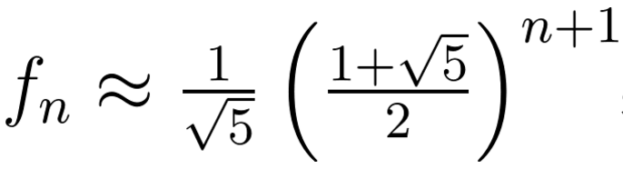

# Fibonacci Algorithms Runtime Comparison
Comparison between runtimes of a **recursive** implementation, a **memoized array** approach storing calculated values in an array to avoid recalculation & a formula using **Phi (the Golden Ratio)**.

## A Fibonacci Number is Defined as
F[0]=0  
F[1]=1  
F[i]=F[i-1]+F[i-2]  
**Indexes start from 0. The very "first" entry in the sequence is the 0th Fibonacci number. This matches up with Java Array positions**

## Methods of Calculation
### Array Memoization
#### `fibonacciMemoizationStoreValues(int n)`
- Calculates & saves all Fibonacci number up to n in an array
- **Memoization** stores the already calculated Fibonacci numbers in an array. The subsequent Fibonacci numbers are calculated by looking up values already stored in the array to avoid recalculation

#### `nthFibonacciMemoization(int n)`
- Just return the *n*th Fibonacci number
- Calls `fibonacciMemoizationStoreValues()` to calculate the array & then access the number as index `n`

### Recursively
#### `nthFibonacciRecursive(int n)`
- Recessively calculate the *n*th Fibonacci Number
- Very inefficient since it's an exponential  algorithm that recalculate all the way down to the base case every time

#### `fibonacciRecursiveStoreValues(int n)`
- Calls `nthFibonacciRecursive()` to store values in array

### Phi φ (Golden Ratio)
Fibonacci Numbers can be approximated with the formula   
Where **≈** means ***Round* to the nearest integer**  
**This only works up to N=50, then the `double` overflows to negative**

#### `nthFibonacciPhi(int n)`
- Use the formula & just get the *n*th Fibonacci number
- No arrays used

#### `fibonacciPhiStoreValues(int n)`
- Calls `nthFibonacciPhi()` to store values in array

## Runtimes
Runtimes are printed to the screen & as saved in a file. [View `runtimes.txt` for sample runtimes](runtimes.txt)
1. **Array Memoization** is fastest, but requires a lot of RAM
2. **Phi / Golden Ratio** method is the fast, but overflows for n>50
3. **Recursive** is dead last & very slow

## Warnings
- `nthFibonacciPhi()` overflows to negative for N>50  
This is because it exceeds Java's `Double.MAX_VALUE`
- `nthFibonacciMemoization()` has a Stack Overflow for **n>10000000**
- `fibonacciRecursiveStoreValues()` takes a significant amount of time for **n>40**

## Code Details
- `callMethod()` runs the given method X+1 times, but ignore the 0th time so `average` time is correctly calculated by `average=totalTime/numberOfCalls`
- `nthFibonacciMemoization(int n)` has the line  
`fibonacciMemoizationStoreValues(n+1)[n]`  
The `n+1` is to that it matches up with output from the other 2 methods of calculating the *n*th Fibonacci Number

## References
- [PHI Golden Ratio Fibonacci Formula](http://www.askamathematician.com/2011/04/q-is-there-a-formula-to-find-the-nth-term-in-the-fibonacci-sequence/)
